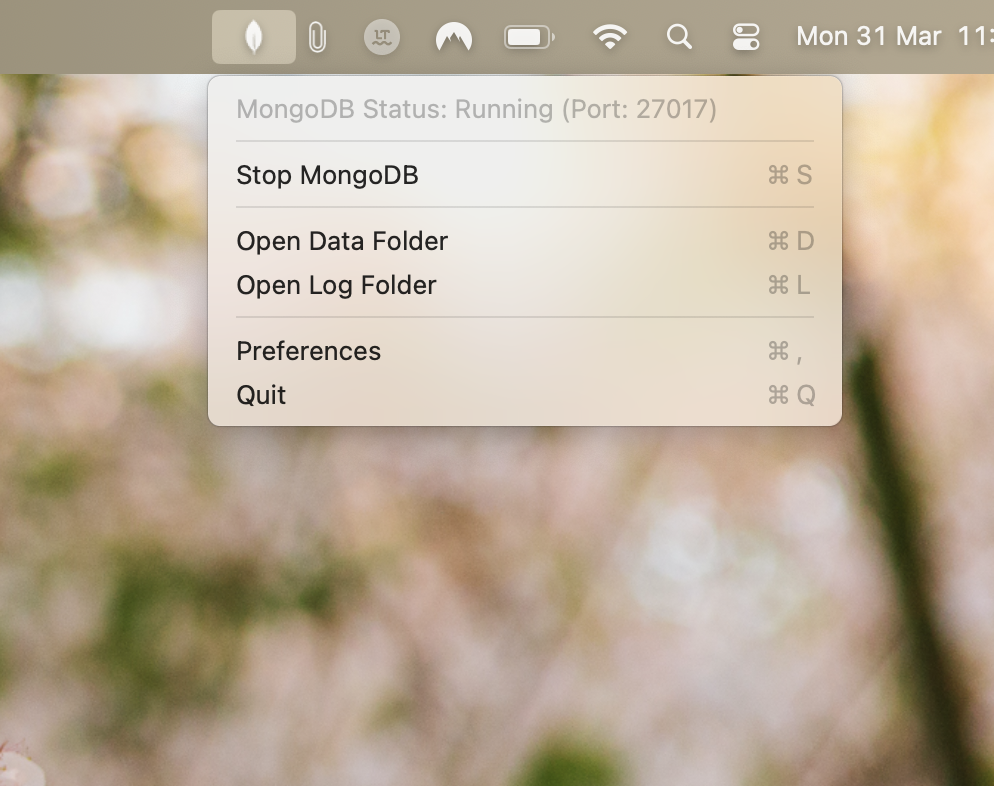
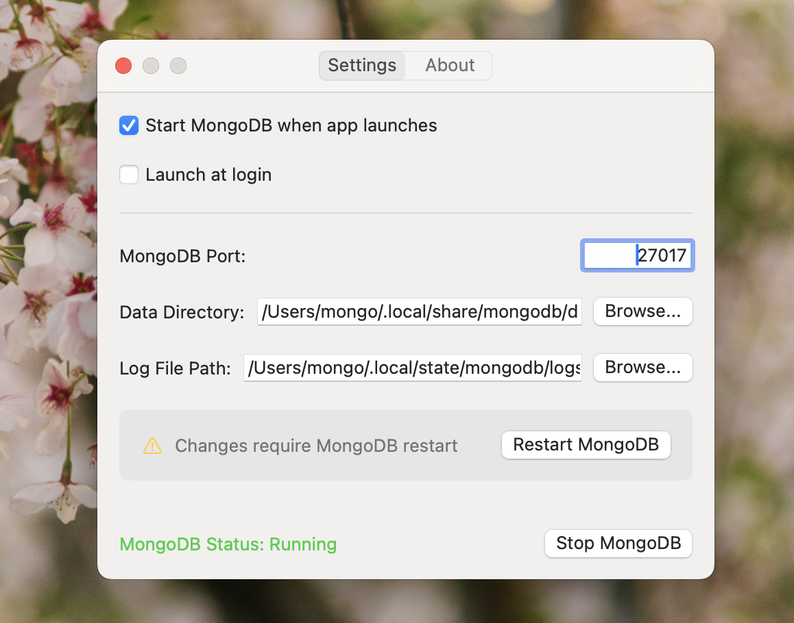
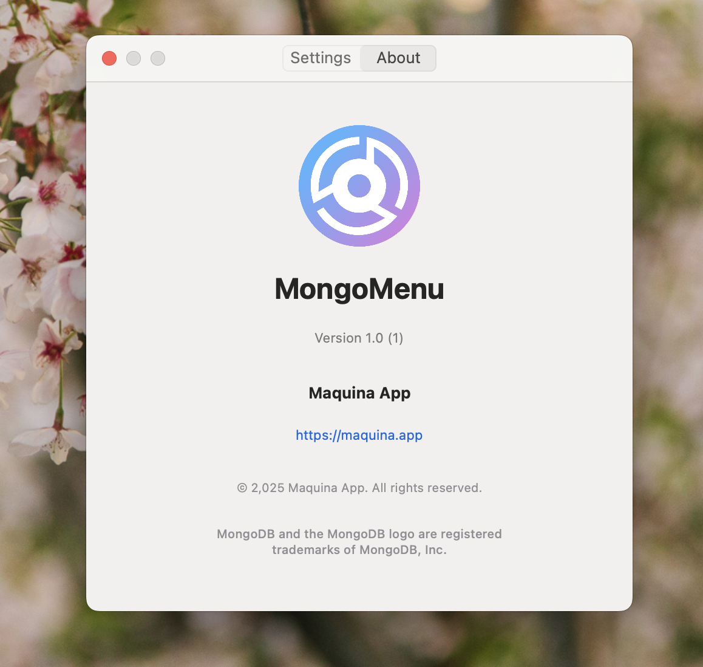

# MongoMenu



A macOS menu bar application that makes managing local MongoDB instances simple and convenient.

## Overview

MongoMenu sits in your macOS menu bar, providing easy access to start, stop, and configure MongoDB instances. It's designed for developers who need to work with MongoDB locally and want a straightforward way to manage the database without terminal commands.

## Features

- **Menu Bar Controls**: Start and stop MongoDB with a single click directly from your menu bar
- **Visual Status Indicator**: Instantly see if MongoDB is running in your menu bar
- **Custom Configuration**: Configure MongoDB's data directory, log path, and port
- **Auto-start Options**: Choose to start MongoDB automatically when the app launches
- **Launch at Login**: Set MongoMenu to start when your Mac boots up
- **Lightweight Footprint**: Minimal resource usage while running in the background

## Screenshots




## Requirements

- macOS 15.0 (Sequoia) or later
- Admin privileges (for first-time setup)

## Installation

To build MongoMenu from source:

1. Clone this repository:

   ```bash
   git clone https://github.com/maquina-app/mongo-menu.git
   cd mongo-menu
   ```

2. Run the build script:

   ```bash
   ./build.sh
   ```

   The build script will:
   - Check if MongoDB binaries exist and download them if needed
   - Build the application
   - Place the built app in `build/Release/MongoMenu.app`

3. Move the built app to your Applications folder

## Building Requirements

- Xcode 16.0 or later
- Command Line Tools for Xcode
- macOS 15.0 (Sequoia) or later

## Usage

1. Click the MongoDB icon in the menu bar to see the status and control options
2. Use "Start MongoDB" or "Stop MongoDB" to control the service
3. Click "Preferences" to configure settings:
   - Data directory location
   - Log file path
   - MongoDB port (default: 27017)
   - Auto-start options
   - Launch at login option

## Technical Details

MongoMenu bundles MongoDB binaries (version 8.0.6) specifically for Apple Silicon Macs, so you don't need to install MongoDB separately. The app handles downloading the appropriate MongoDB binaries for your Mac.

By default, MongoMenu stores:

- MongoDB data in `~/.local/share/mongodb/data`
- MongoDB logs in `~/.local/state/mongodb/logs/mongodb.log`

Both of these locations can be customized in the app preferences.

## Troubleshooting

### MongoDB Won't Start

- Check if the port is already in use by another application
- Ensure you have write permissions to the data directory and log path
- Check the log file for specific error messages

### App Won't Launch

- Make sure you have macOS Sequoia (15.0) or later installed
- Try rebuilding from source using the build script

## Contributing

Contributions are welcome! Please feel free to submit a Pull Request.

1. Fork the repository
2. Create your feature branch (`git checkout -b feature/amazing-feature`)
3. Commit your changes (`git commit -m 'Add some amazing feature'`)
4. Push to the branch (`git push origin feature/amazing-feature`)
5. Open a Pull Request

## Created By

This application was created by Mario Alberto Chávez.

## License

This project is licensed under the MIT License - see the [LICENSE](LICENSE) file for details.

## Copyright

© 2025 Maquina App. All rights reserved.

## Disclaimer

MongoDB and the MongoDB logo are registered trademarks of MongoDB, Inc. This application is not affiliated with or endorsed by MongoDB, Inc.
